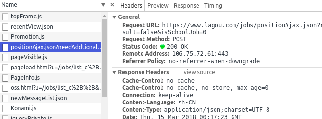
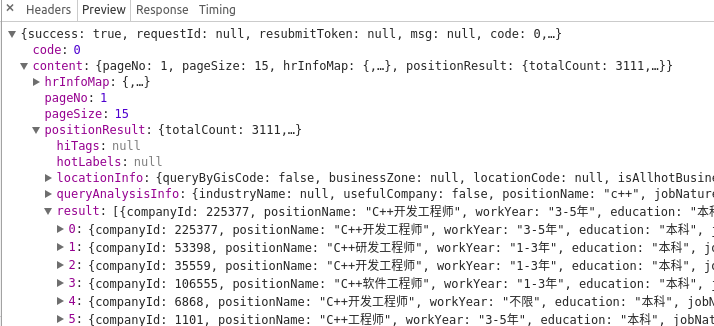
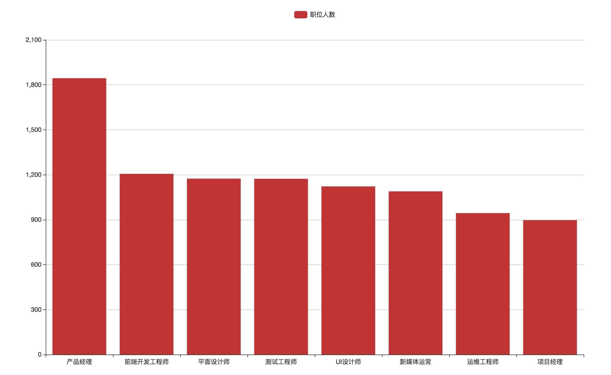
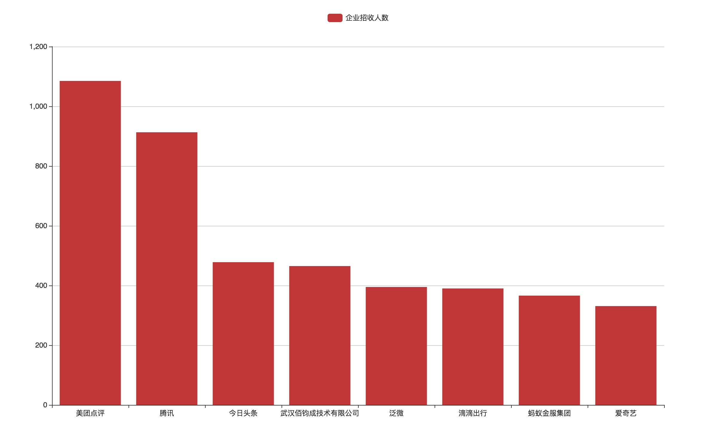
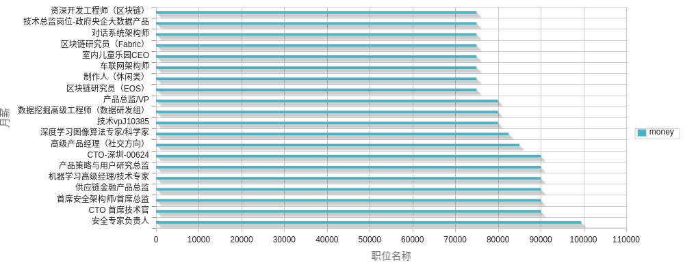
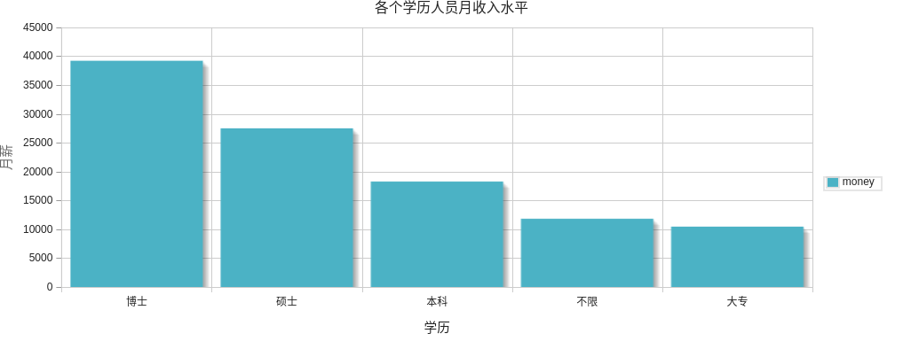
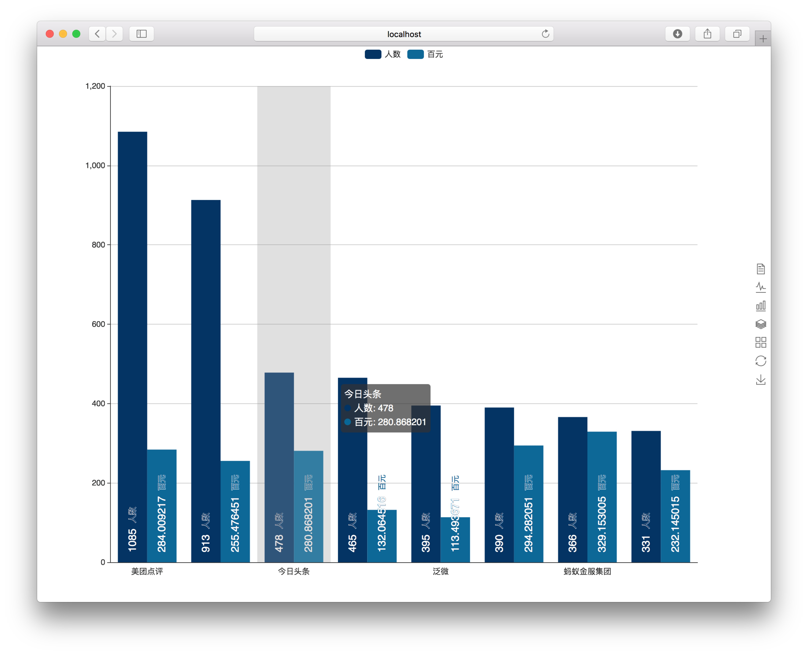

# 拉勾网爬虫与数据挖掘
## 描述
爬取拉勾网50万条职位信息，进行数据清洗，简单的数据分析。


## 环境
**操作系统**  
- Ubuntu 16.04
- mac OS 10.13.3 

**数据获取**  
- Chrome
- Python3

**数据清洗**  
- Excel
- DataGrip
- MySQL
- phpMyAdmin
- VScode
- Anaconda Jupyter Notebook

**数据分析**  
- Excel
- DataGrip
- MySQL
- phpMyAdmin
- Anaconda Jupyter Notebook

**数据可视化**
- HTML
- Bootstrap
- JavaScript
- PHP
- Echarts

### Python模块
- request
- BeautifulSoup
- Json
- numpy
- pandas
- matplotlib
### 文件描述
- `get_position.py`爬取拉勾网的爬虫程序
- `position_name.txt`保存拉勾所有职位
## 数据获取
- 使用Chrom分析拉勾源码，发现拉勾网使用Ajax请求数据如下图所示：

- 返回的数据是Json格式，处理起来非常方便，如下图所示：

- 需要的职位信息在`object -> content -> positionResult -> result`

- 拉勾的反爬虫策略
## 数据清洗
###  去重(SQL)
```sql
CREATE TABLE tmp2 as select min(id) as mid from tab3 group by 职位ID

CREATE TABLE lagou2 as SELECT * FROM lagou WHERE id in (SELECT mid from tmp2)
``` 
### 去重(Pandas)
- 经过手工的查看有大量的重复值，使用`pandas`的`drop_duplicates(subset=['positionId'])`将重复的`positionId`去掉，只保留一行重复记录。
- 用`pandas`的`pandas.DataFrame.to_csv()`将去重的文件保存为csv文件
- Excel 2016打开去重的csv文件，利用快速填充提取字段的`4k-8k`等工资字段，取平均值。工作年限使用同样的操作提取
- 创建MySQL数据库以导入csv文件，创建数据库如下,这里用的是`phpMyAdmin`手动创建数据库字段，自动生成创建语句：
```sql
CREATE TABLE `LAGOU`.`position` ( `ID` INT NOT NULL AUTO_INCREMENT , `positionId` INT(10) NOT NULL , `positionLables` VARCHAR(20) NOT NULL , `positionName` VARCHAR(20) NOT NULL , `positionAdvantage` VARCHAR(20) NOT NULL , `firstType` VARCHAR(20) NOT NULL , `secondType` VARCHAR(20) NOT NULL , `workYear` INT(10) NOT NULL , `education` VARCHAR(20) NOT NULL , `salary` VARCHAR(20) NOT NULL , `isSchoolJob` VARCHAR(5) NOT NULL , `companyId` INT(10) NOT NULL , `companyShortName` VARCHAR(20) NOT NULL , `companyFullName` VARCHAR(20) NOT NULL , `companySize` VARCHAR(20) NOT NULL , `financeStage` VARCHAR(20) NOT NULL , `industryField` VARCHAR(20) NOT NULL , `industryLables` VARCHAR(20) NOT NULL , `createTime` VARCHAR(20) NOT NULL , `formatCreateTime` VARCHAR(20) NOT NULL , `city` VARCHAR(20) NOT NULL , `district` VARCHAR(20) NOT NULL , `businessZones` VARCHAR(20) NOT NULL , `linestaion` VARCHAR(20) NOT NULL , `stationname` VARCHAR(20) NOT NULL , PRIMARY KEY (`ID`)) ENGINE = InnoDB
```
### 处理缺失值

### 其他
- 缺失值

```sql
ALTER TABLE L拉勾 ADD 工作年限 INT NULL;
ALTER TABLE L拉勾
  MODIFY COLUMN 工作年限 INT AFTER 工龄;
UPDATE L拉勾 SET 工作年限 = 4 WHERE 工龄 = '3-5年';
UPDATE L拉勾 SET 工作年限 = 2 WHERE 工龄 = '1-3年';
UPDATE L拉勾 SET 工作年限 = 8 WHERE 工龄 = '5-10年';
UPDATE L拉勾 SET 工作年限 = 10 WHERE 工龄 = '十年以上';
UPDATE L拉勾 SET 工作年限 = 1 WHERE 工龄 = '一年以下';
UPDATE L拉勾 SET 工作年限 = 0 WHERE 工龄 = '应届毕业生';
```
## 数据分析
### 利用MySQL进行简单的统计分析
- 招收人数最多的几个职位
```sql
SELECT 企业简称, COUNT(企业简称) as cnt FROM L拉勾 GROUP BY 企业简称 
```

- 前100公司的招收人数
```sql
SELECT 企业简称,COUNT(企业简称) as cnt FROM L拉勾 GROUP BY 企业简称 ORDER BY cnt DESC LIMIT 100
```

- 月薪最高的100个职位
```sql
SELECT 职位名称,avg(工资) as money FROM L拉勾 GROUP BY 职位名称 ORDER BY money DESC LIMIT 100
```

- 学历水平工资
```sql
SELECT 学历,avg(工资) as money FROM L拉勾 GROUP BY 学历 ORDER BY money DESC
```

- 各个公司招收人的工薪水平
```sql
SELECT 企业简称,COUNT(企业简称) as cnt ,avg(工资) as money FROM L拉勾 GROUP BY 企业简称 ORDER BY cnt DESC,money DESC LIMIT 100
```

## 利用SKlearn进行数据分析
## 数据预处理（中文分词、去除标点符号）
先构建一个字典过滤标点符号，通过Python的`jieba`模块进行精确匹配模式进行分词后用空格分隔。示例如下：  
```python
# encoding=utf-8
chrs = ['，','。','！','、','；','：','？','~','(',')','；',';',',','\n','\t','/','-','.','\'']
corpus = []
for line in corpus_raw:
    for ch in chrs:
        line = line.replace(ch,'')
    Word_spilt_jieba = jieba.cut(line,cut_all = False)
    line = ' '.join(Word_spilt_jieba)
    corpus.append(line)
print(corpus[0:3])
```
**对于职位的描述分词之后的结果如下所示，包含一些明确的关键词，同样也包含一些无关紧要的数字，在这里先不处理数字英文单词之类的（后续的预测准确率表明数字对结果影响不大）：**
```
职位 要求 1 有 互联网 和 移动 互联网 行业 3 年 以上 产品 经理 从业 经验 2 独立 承担 项目 丰富 的 ERP 产品设计 经验 2 懂 app 基本 设计 流程 熟悉 微信 公众 号 的 后台 框架 及 运营 3 具备 项目 方案 起草 需求 整理 开发计划 及 相关 业务 对接 的 能力 4 有 很 强 的 产品 逻辑 与 项目 执行 能力 协调 沟通 部门 内外部 的 资源 5 具备 决策 和 项目 团队 管理 经验
```
## 特征选择
### 词袋模型（ Bag-of-Words Model ）

1. 使用机器学习算法时，我们不能直接使用文本。相反，我们需要将文本转换为数字。  
1. 对文档进行分类，每一类文档都是“输入”，而类别标签是我们预测算法的“输出”。算法将数字向量作为输入，因此我们需要将文档转换为固定长度的数字向量。  
1. 上面这一步可以通过为每个单词分配一个唯一的编码来完成。我们所看到的任何文档都可以被编码为一个固定长度的矢量，其长度为文档中全部已知单词的词汇量。矢量中每个位置的值可以用编码文档中每个单词的出现个数或频率填充。  
1. 在词袋模型中，我们只关心编码方案，而编码方案描述了文档中出现了什么单词，以及这些单词在编码文档中出现的频率，而没有任何关于顺序的信息。  

**对所有职位信息通过Python拉取数据库数据进行遍历，构建一个非常大的词袋，拉去50条职位描述信息时，构成的词袋长度就有2000条左右，这里局限于个人电脑和服务器的内存太小只用了小样本进行了构建词袋**

### 使用 CountVectorizer 计算字数
CountVectorizer 提供了一个简单的方法，既可以标记文本文档的集合, 也可以生成每个已知单词的索引, 还可以使用这一套索引对新文档进行编码。  

下面是一种使用方法：
- 实例化一个 CountVectorizer 类。
- 调用 fit() 函数以从一个或多个文档中建立索引。
- 根据需要在一个或多个文档中调用 transform() 函数，将每个文档编码为一个向量。

```
#该类会将文本中的词语转换为词频矩阵，矩阵元素a[i][j] 表示j词在i类文本下的词频  
vectorizer=CountVectorizer()    
X = vectorizer.fit_transform(corpus)
```

> 稀疏矩阵  
由于大多数文本文档通常只使用文本词向量全集中的一个小子集，所以得到的矩阵将具有许多特征值为零（通常大于99％）。  
例如，10,000 个短文本文档（如电子邮件）的集合将使用总共100,000个独特词的大小的词汇，而每个文档将单独使用100到1000个独特的单词。  
为了能够将这样的矩阵存储在存储器中，并且还可以加速代数的矩阵/向量运算，实现通常将使用诸如 scipy.sparse 包中的稀疏实现。
构造稀疏矩阵，对每一条记录分词之后
## 特征提取
在一个大的文本语料库中，一些单词将出现很多次（例如 “the”, “a”, “is” 是英文），因此对文档的实际内容没有什么有意义的信息。 如果我们将直接计数数据直接提供给分类器，那么这些频繁词组会掩盖住那些我们关注但很少出现的词。  
为了为了重新计算特征权重，并将其转化为适合分类器使用的浮点值，因此使用 tf-idf 变换是非常常见的。  
- 如何使用 CountVectorizer 将文本转换为文字计数向量。
`from sklearn.feature_extraction.text import CountVectorizer`
- 如何使用 TfidfVectorizer 将文本转换为词频向量。
# 数据库
## 查询
- 去重查询
```sql
SELECT positionId,COUNT(DISTINCT positionId) FROM position GROUP by positionId
```
- 查询各个职位招收人数
```sql
SELECT 职位名称,COUNT(职位名称) FROM L拉勾职位表 GROUP BY 职位名称 order BY COUNT(职位名称) desc
```
## 创建数据库
```SQL
CREATE TABLE `LAGOU`.`position` ( `ID` INT NOT NULL AUTO_INCREMENT , `positionId` INT(10) NOT NULL , `positionLables` VARCHAR(20) NOT NULL , `positionName` VARCHAR(20) NOT NULL , `positionAdvantage` VARCHAR(20) NOT NULL , `firstType` VARCHAR(20) NOT NULL , `secondType` VARCHAR(20) NOT NULL , `workYear` INT(10) NOT NULL , `education` VARCHAR(20) NOT NULL , `salary` VARCHAR(20) NOT NULL , `isSchoolJob` VARCHAR(5) NOT NULL , `companyId` INT(10) NOT NULL , `companyShortName` VARCHAR(20) NOT NULL , `companyFullName` VARCHAR(20) NOT NULL , `companySize` VARCHAR(20) NOT NULL , `financeStage` VARCHAR(20) NOT NULL , `industryField` VARCHAR(20) NOT NULL , `industryLables` VARCHAR(20) NOT NULL , `createTime` VARCHAR(20) NOT NULL , `formatCreateTime` VARCHAR(20) NOT NULL , `city` VARCHAR(20) NOT NULL , `district` VARCHAR(20) NOT NULL , `businessZones` VARCHAR(20) NOT NULL , `linestaion` VARCHAR(20) NOT NULL , `stationname` VARCHAR(20) NOT NULL , PRIMARY KEY (`ID`)) ENGINE = InnoDB
```
## 导入导出数据库
### 导出数据库
- 导出数据库为sql文件
```SQL
mysqldump -u root -p database_name table_name > dump.txt
password *****
```
- 导出数据库为csv文件
```sql
SELECT * FROM passwd INTO OUTFILE '/tmp/tutorials.txt' FIELDS TERMINATED BY ',' ENCLOSED BY '"'
LINES TERMINATED BY '\r\n';
```
### 导入数据库
- csv文件导入数据库  

```SQL
load data local infile '/home/ubuntu//workspace/Lagou_Spider/lagou.txt'
into table position_2
fields terminated by ','  optionally enclosed by '"' escaped by '"'
lines terminated by '\n';
```
- 导入数据库sql文件
```SQL
mysql -u root -p database_name < dump.txt password *****
```

## 其他常用命令和脚本
- 统计文件行数
```shell
wc -l file
```
- tmux
```shell
tmux new -s session
tmux new -s session -d #在后台建立会话
tmux ls #列出会话
tmux attach -t session #进入某个会话
```

- 合并文件
```python
import os
filenames = os.listdir("./position_id_files/")
with open('all_describe_to_one.txt','a',encoding='utf-8') as f_write:
    for filename in filenames:
        with open('./position_id_files/'+filename,'r',encoding='utf-8') as f_read:
            for line in f_read.readlines():
                f_write.write(line)
```

- 去重
```python
import pandas as pd
df = pd.read_csv(ready_to_read_file)
df2=df.drop_duplicates(subset=['positionId'])
df2.to_csv(ready_to_write_file)
```
## 参考
> https://www.jianshu.com/p/16cd37a5355f>  
> https://www.zhihu.com/search?type=content&q=%E6%8B%89%E5%8B%BE%20%E7%88%AC%E8%99%AB>
> https://www.w3cschool.cn/mysql/mysql-database-export.html  
> http://blog.csdn.net/liuxuejiang158blog/article/details/31360765  
> http://blog.csdn.net/tiffany_li2015/article/details/50236833  
> http://sklearn.apachecn.org/cn/0.19.0/modules/feature_extraction.html
> http://www.cnblogs.com/qcloud1001/p/8444576.html  