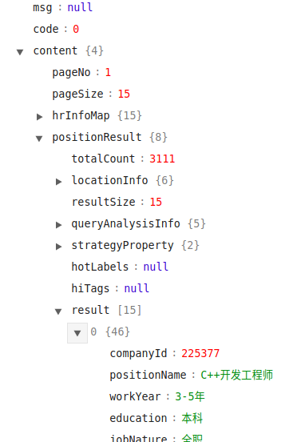

# 拉勾网爬虫与数据挖掘
## 描述
爬取拉勾网50万条职位信息，进行数据清洗，数据挖掘。
## 环境
- Ubuntu 16.04
- mac OS 10.13.3 
- MySQL
- phpMyAdmin
- Chrome
- Python3
- VScode
- Anaconda Jupyter Notebook
- DataGrip
### Python模块
- request
- BeautifulSoup
- Json
- numpy
- pandas
- matplotlib
### 文件描述
- `get_position.py`爬取拉勾网的爬虫程序
- `position_name.txt`保存拉勾所有职位
## 数据获取
- 使用Chrom分析拉勾源码，发现拉勾网使用Ajax请求数据如下图所示：

- 返回的数据是Json格式，处理起来非常方便，如下图所示：

- 需要的职位信息在`object -> content -> positionResult -> result`

## 数据清洗
### 去重
经过手工的查看有大量的重复值，使用`pandas`的`drop_duplicates(subset=['positionId'])`将重复的`positionId`去掉，只保留一行重复记录。
### 处理缺失值
### 其他
- 工作年限的提取
```sql
ALTER TABLE L拉勾 ADD 工作年限 INT NULL;
ALTER TABLE L拉勾
  MODIFY COLUMN 工作年限 INT AFTER 工龄;
UPDATE L拉勾 SET 工作年限 = 4 WHERE 工龄 = '3-5年';
UPDATE L拉勾 SET 工作年限 = 2 WHERE 工龄 = '1-3年';
UPDATE L拉勾 SET 工作年限 = 8 WHERE 工龄 = '5-10年';
UPDATE L拉勾 SET 工作年限 = 10 WHERE 工龄 = '十年以上';
UPDATE L拉勾 SET 工作年限 = 1 WHERE 工龄 = '一年以下';
UPDATE L拉勾 SET 工作年限 = 0 WHERE 工龄 = '应届毕业生';
```
## 数据分析
- 前100公司的招收人数
```sql
SELECT 企业简称,COUNT(企业简称) as cnt FROM L拉勾 GROUP BY 企业简称 ORDER BY cnt DESC LIMIT 100
```
- 月薪最高的100个职位
```sql
SELECT 职位名称,avg(工资) as money FROM L拉勾 GROUP BY 职位名称 ORDER BY money DESC LIMIT 100
```
- 学历水平工资
```sql
SELECT 学历,avg(工资) as money FROM L拉勾 GROUP BY 学历 ORDER BY money DESC
```
- 各个公司招收人的工薪水平
```sql
SELECT 企业简称,COUNT(企业简称) as cnt ,avg(工资) as money FROM L拉勾 GROUP BY 企业简称 ORDER BY cnt DESC,money DESC LIMIT 100
```

## 其他常用命令
- 统计文件行数
```shell
wc -l file
```
- tmux
```shell
tmux new -s session
tmux new -s session -d #在后台建立会话
tmux ls #列出会话
tmux attach -t session #进入某个会话
```
# 数据库
## 查询
- 去重查询
```sql
SELECT positionId,COUNT(DISTINCT positionId) FROM position GROUP by positionId
```
- 查询各个职位招收人数
```sql
SELECT 职位名称,COUNT(职位名称) FROM L拉勾职位表 GROUP BY 职位名称 order BY COUNT(职位名称) desc
```
## 创建数据库
```SQL
CREATE TABLE `LAGOU`.`position` ( `ID` INT NOT NULL AUTO_INCREMENT , `positionId` INT(10) NOT NULL , `positionLables` VARCHAR(20) NOT NULL , `positionName` VARCHAR(20) NOT NULL , `positionAdvantage` VARCHAR(20) NOT NULL , `firstType` VARCHAR(20) NOT NULL , `secondType` VARCHAR(20) NOT NULL , `workYear` INT(10) NOT NULL , `education` VARCHAR(20) NOT NULL , `salary` VARCHAR(20) NOT NULL , `isSchoolJob` VARCHAR(5) NOT NULL , `companyId` INT(10) NOT NULL , `companyShortName` VARCHAR(20) NOT NULL , `companyFullName` VARCHAR(20) NOT NULL , `companySize` VARCHAR(20) NOT NULL , `financeStage` VARCHAR(20) NOT NULL , `industryField` VARCHAR(20) NOT NULL , `industryLables` VARCHAR(20) NOT NULL , `createTime` VARCHAR(20) NOT NULL , `formatCreateTime` VARCHAR(20) NOT NULL , `city` VARCHAR(20) NOT NULL , `district` VARCHAR(20) NOT NULL , `businessZones` VARCHAR(20) NOT NULL , `linestaion` VARCHAR(20) NOT NULL , `stationname` VARCHAR(20) NOT NULL , PRIMARY KEY (`ID`)) ENGINE = InnoDB
```
## 导入导出数据库
- csv文件导入数据库
```SQL
load data local infile '/home/ubuntu//workspace/Lagou_Spider/lagou.txt'
into table position_2
fields terminated by ','  optionally enclosed by '"' escaped by '"'
lines terminated by '\n';
```
- 导出数据库
```SQL
mysqldump -u root -p database_name table_name > dump.txt
password *****
```
- 导出文件
```sql
SELECT * FROM passwd INTO OUTFILE '/tmp/tutorials.txt' FIELDS TERMINATED BY ',' ENCLOSED BY '"'
LINES TERMINATED BY '\r\n';
```
- 导入数据库sql文件
```SQL
mysql -u root -p database_name < dump.txt password *****
```
## 参考
https://www.jianshu.com/p/16cd37a5355f  
https://www.zhihu.com/search?type=content&q=%E6%8B%89%E5%8B%BE%20%E7%88%AC%E8%99%AB